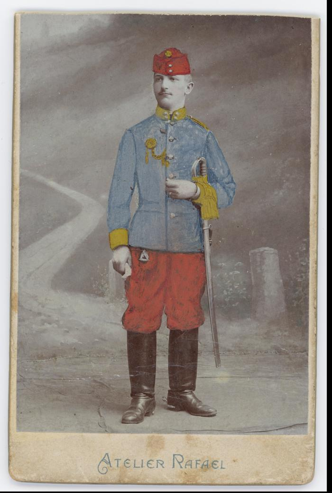
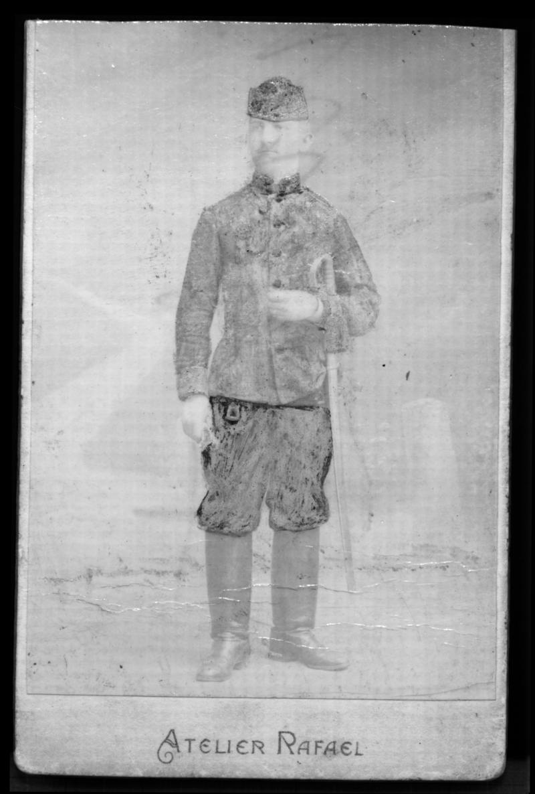
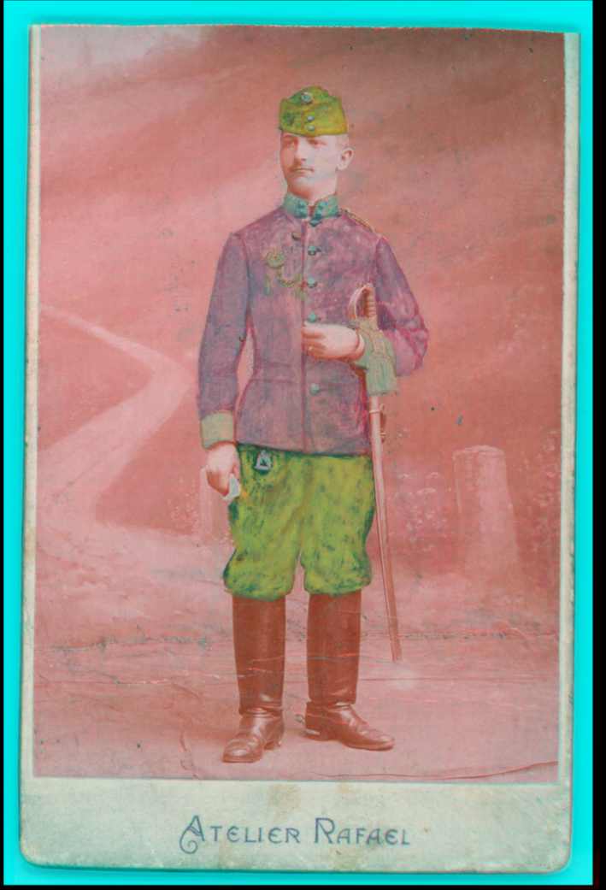
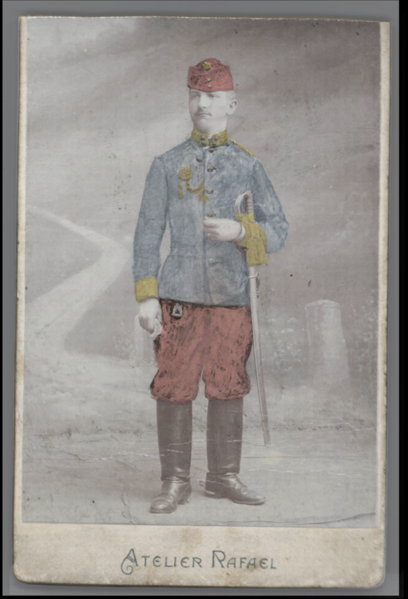
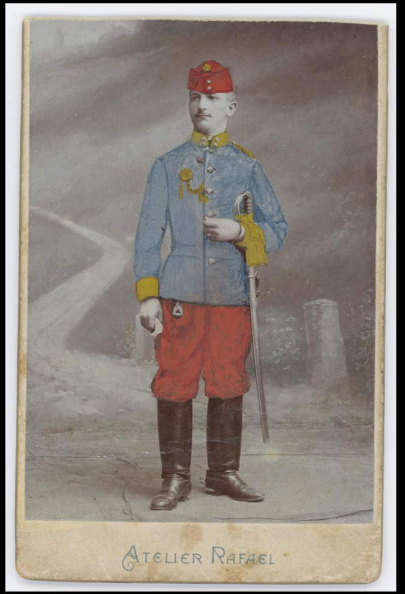
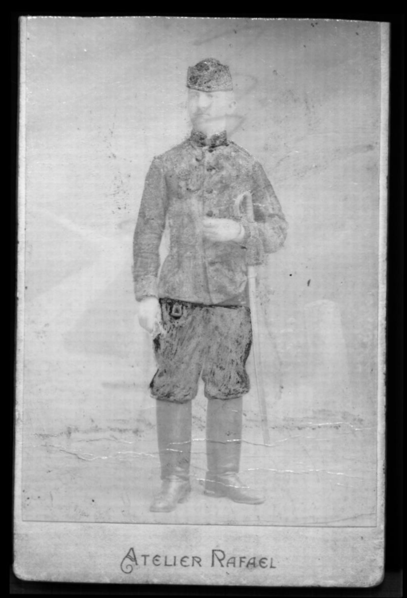

# IR False color
https://github.com/almaavu/falsevisir

**Program pro automatické vytvoření obrazu ve falešných barvách spojením snímků ve viditelném a infračerveném světle.**

### Instalace:
- instalace programovacího jazyka Python3

    https://www.python.org/downloads/
    
- instalace programu ir_false_color

    pip install git+https://github.com/almaavu/ir_false_color.git

### Použití:
    python -m ir_false_color vis_soubor.jpg ir_soubor.jpg  

### Vstupní data:
Cesta a název souboru snímku ve viditelném světla (formát RGB) a infračerveného snímku (formát RGB nebo stupně šedé)

### Postup:
- Změna velikosti obrázků na stejnou výšku
- Transformace snímků pro přesné překrytí - oprava rozdílů v natočení, perspektivním zkreslení, zkreslení různých objektivů apod. (obrázky musí mít podobné rysy, jinak  může selhat)
- Spojení obrazů do falešných barev - výsledný RGB snímek obsahuje R kanál z IR snímku,
     G kanál z VIS-R a B kanál z VIS-G (VIS-B je vyřazen)
- Prolnutí obrazů (50% IR, 50% VIS)

### Výstup:
- Snímek ve falešných barvách
- Snímek s překrytými snímky v IR a VIS světle (50 % IR + 50 % VIS)
- Transformované snímky v IR a VIS světle (se snímky lze dále pracovat, např. pro vytvoření prolnutí s jinými parametry)

### Odkazy:

https://en.wikipedia.org/wiki/False_color

https://chsopensource.org/infrared-false-color-photography-irfc/

https://en.wikipedia.org/wiki/Affine_transformation

## Ukázka:

### Zdrojové obrázky:

  
  

### Výsledek:
Obraz ve falešných barvách

  

Prolnutí

  

Transformované snímky

  
    

