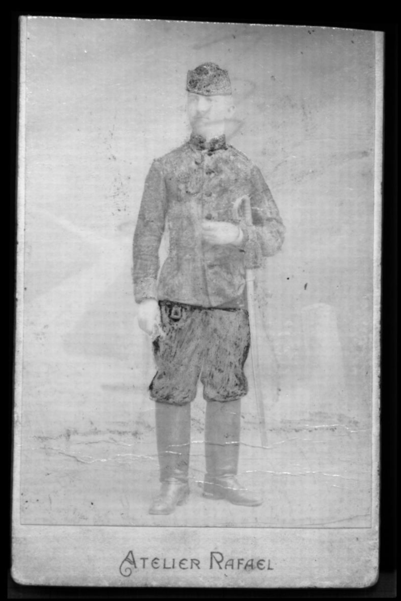

# FalseVisir
https://github.com/almaavu/falsevisir

**Program pro automatické vytvoření obrazu ve falešných barvách spojením snímků ve viditelném a infračerveném světle.**


Zobrazení ve falešných barvách je technika zpracování obrazu používaná při průzkumu uměleckých děl (např. závěsných obrazů, nástěnných maleb, polychromovaných plastik). Pro vyhodnocení je vhodné porovnat snímky získané infračervenou reflektografií (IRR) se snímky ve viditelném světle (VIS). Spojení obou obrazů do snímku ve falešných barvách může pomoci při studiu podmalby nebo pro identifikaci některých pigmentů. [[1]](#1), [[2]](#2).

Ve výsledném obrazu jsou RGB kanály využity takto:
```
    IRR   -> R
    Vis R -> G
    Vis G -> B
    Vis B ->  
```

Příklad složení snímku v infračerveném světle s červeným a zeleným kanálem snímku ve viditelném světle:
<TABLE>
   <TR>
      <TD>IRR</TD>
      <TD></TD>
      <TD colspan="3" align="center" style="text-align: center; vertical-align: middle;"></TD>
   </TR>
   <TR>
      <TD>VIS</TD>
      <TD></TD>
      <TD colspan="3" align="center" style="text-align: center; vertical-align: middle;"></TD>
   </TR>
   <TR>
      <TD>VIS R G B</TD>  
      <TD></TD>
      <TD></TD>
      <TD></TD>
      <TD></TD>
   </TR>
      <TR>
      <TD>False color R G B</TD>
      <TD></TD>
      <TD></TD>
      <TD></TD>
      <TD></TD>
   </TR>
   <TR>
      <TD>False color</TD>
      <TD colspan="3" align="center" style="text-align: center; vertical-align: middle;"></TD>
      <TD></TD>
   </TR>
</TABLE>


Pro složení snímků jsou obvykle využívány grafické editory (Adobe Photoshop, GIMP, ...). Snímky jsou zobrazeny přes sebe, pro přesný překryv je obvykle je nutné je transformovat a napravit tak zkreslení způsobené rozdíly v geometrii zobrazení (natočení, perspektivní zkreslení) a použitých objektivech (soudkovité zkreslení). 

Pokud mají oba snímky podobné rysy, je možné transformaci a následné složení do falešných barev provést automaticky programem FalseVisir. To je výhodné zejména při zpracování většího počtu snímků.   

---

## Instalace:

Instalace programovacího jazyka **Python3**

    https://www.python.org/downloads/
    
Instalace programu **FalseVisir**

    python -m pip install --upgrade git+https://github.com/almaavu/falsevisir.git#egg=falsevisir

    
    
Instalace knihoven:

    python -m pip install --upgrade requirements.txt
    
* numpy
* matplotlib
* scikit-image
* scipy
* imageio

---

## Použití:

Program lze spustit z **příkazového řádku** se zadáním cesty ke vstupním souborům - obrázku ve viditelném a infračerveném světle.

    python -m falsevisir "vis_soubor.jpg" "ir_soubor.jpg"  
    
Skript je možné spustit i bez instalace:

    python falsevisir.py "vis_soubor.jpg" "ir_soubor.jpg" 

Program je také možné spustit interaktivně v prostředí **Jupyter notebook**, to je výhodné v případě, kdy je potřeba sledovat jednotlivé kroky zpracování obrazů, např. při úpravě  nastavení konfigurace programu. 

    jupyter notebook falsevisir_jupyter.ipynb

Program **falsevisir_batch.py** je určený pro hromadné zpracování většího počtu obrázků. Program načte snímky ze zvolených složek a zpracuje páry souborů podle ID souborů, které musí být uvedeno na začátku názvu následované podtržítkem. Zpracuje např. soubory "a001_vis_image.jpg" a "a001_ir_image.jpg". 

    python falsevisir_batch.py "samples/vis_samples/" "samples/ir_samples/"  

### Vstupní data:
Cesta a název souboru snímku ve viditelném světla (formát RGB) a infračerveného snímku (formát RGB nebo stupně šedé). Snímky by měly být oříznuté na přibližně stejný výřez (bez přehnaně širokých okrajů). Mohou být různě pootočené (viz ukázky).

### Funkce programu:
- Změna velikosti obrázků na stejnou výšku
- Transformace snímků pro přesné překrytí - oprava rozdílů v natočení, perspektivním zkreslení, zkreslení různých objektivů apod. (obrázky musí mít podobné rysy, jinak  může selhat) [[3]](#3)
- Spojení obrazů do falešných barev (IRR-R-G)
- Prolnutí obrazů (50% IRR, 50% VIS)
- Uložení výsledků


### Konfigurace:
Parametry jsou uloženy v globální proměnné CFG. Jejich úprava může být užitečná, pokud program nenajde správnou transformaci.
- downsize: výška zmenšeného obrázku v pixelech. Zmenšené snímky program používá pro urychlení výpočtu transformace. Změna velikosti může pomoci, když transformace selže. Vyšší hodnota vede k pomalejšímu výpočtu, výchozí hodnota: 500 pix.  
- preprocess_images: Před výpočtem transformace je lze provést úpravu jasu a kontrastu ("normalize"), equalizaci histogramu ("equalize") nebo detekci hran ("edge")
- extract_features: parametry funkce pro výběr bodů
- ransac: parametry Ransac algoritmu použitého pro výběr odpovídajících dvojic bodů
- match: parametry match algoritmu


### Výstup:
- Snímek ve falešných barvách
- Snímek s překrytými snímky v IR a VIS světle (50 % IR + 50 % VIS)
- Transformované snímky v IR a VIS světle (se snímky lze dále pracovat, např. pro vytvoření prolnutí s jinými parametry)

---

## Ukázka:

### Zdrojové obrázky:
<p align="center">
  
  
</p>

### Výsledek:
Obraz ve falešných barvách
<p align="center">
  
</p>
Prolnutí
<p align="center">
  
</p>
Transformované snímky
<p align="center">
  
    
</p>

---

### Odkazy:
<a id="1">[1]</a> 
https://en.wikipedia.org/wiki/False_color

<a id="2">[2]</a> 
[Cosentino, A. Identification of pigments by multispectral imaging; a flowchart method. herit sci 2, 8 (2014). https://doi.org/10.1186/2050-7445-2-8](https://heritagesciencejournal.springeropen.com/articles/10.1186/2050-7445-2-8)

<a id="3">[3]</a> 
https://en.wikipedia.org/wiki/Affine_transformation
