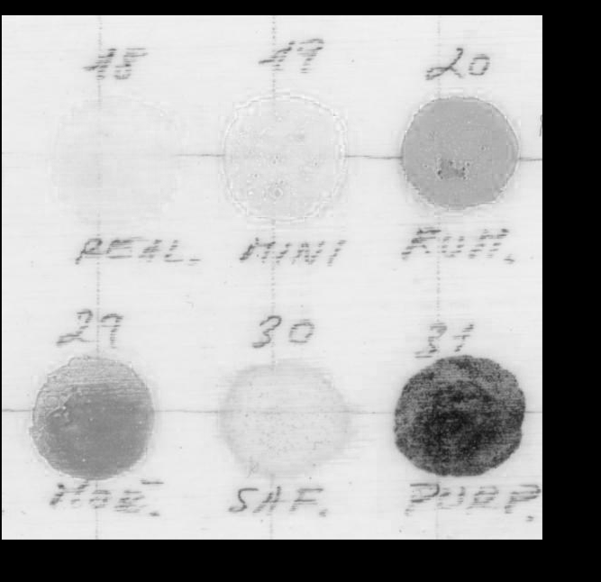
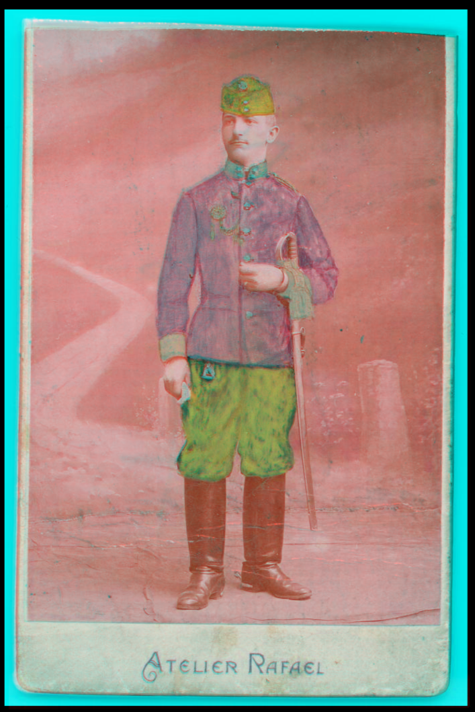
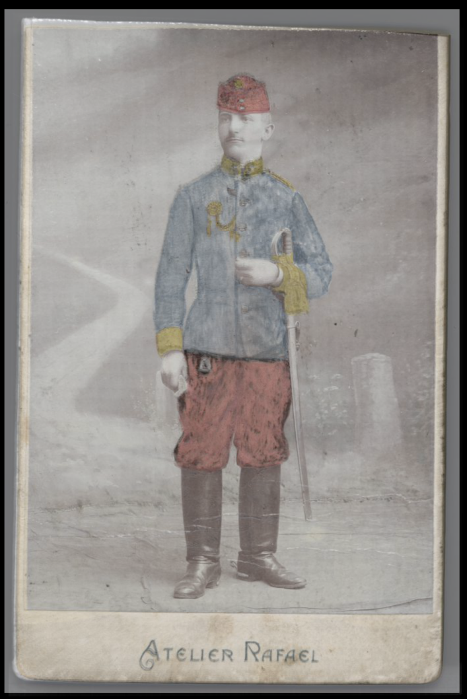
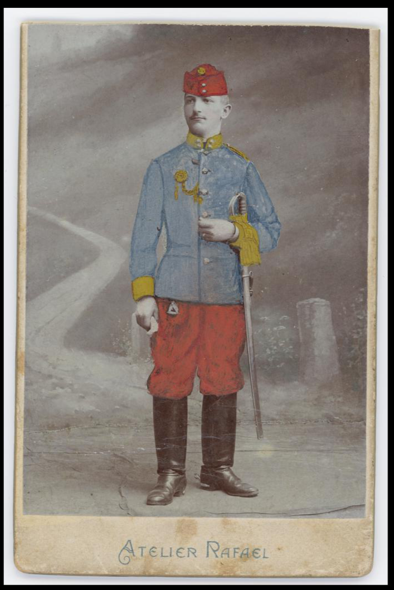

# FalseVisir
https://github.com/almaavu/falsevisir

**Combine infrared and visible light images of the same object to false colors automatically.**

False colour imaging is an image processing technique used in the study of works of art (e.g. paintings on canvas, wood, wall paintings or polychrome sculptures). For evaluation, it is useful to compare images obtained by infrared reflectance (IRR) with visible light (VIS) images. Combining the two images into a false-colour image can help in the study of underpainting or for the identification of certain pigments.

Visible image RGB channels and infrared image are combined in this way:
```
    IRR   -> R
    Vis R -> G
    Vis G -> B
    Vis B ->  
```

Example of IRR and VIS R + G channel merge:
<TABLE>
   <TR>
      <TD>IRR</TD>
      <TD></TD>
      <TD colspan="3" align="center" style="text-align: center; vertical-align: middle;"></TD>
   </TR>
   <TR>
      <TD>VIS</TD>
      <TD></TD>
      <TD colspan="3" align="center" style="text-align: center; vertical-align: middle;"></TD>
   </TR>
   <TR>
      <TD>VIS R G B</TD>  
      <TD></TD>
      <TD></TD>
      <TD></TD>
      <TD></TD>
   </TR>
      <TR>
      <TD>False color R G B</TD>
      <TD></TD>
      <TD></TD>
      <TD></TD>
      <TD></TD>
   </TR>
   <TR>
      <TD>False color</TD>
      <TD colspan="3" align="center" style="text-align: center; vertical-align: middle;"></TD>
      <TD></TD>
   </TR>
</TABLE>


Graphic editors (Adobe Photoshop, GIMP, ...) are usually used to compose images. The images are displayed over each other, and for an accurate overlay it is usually necessary to transform them to correct distortions caused by differences in the display geometry (rotation, perspective distortion) and the lenses used (barrel distortion).

If both images have similar features, the transformation and subsequent compositing into false colours can be done automatically by the FalseVisir program. This is particularly advantageous when processing a large number of images.


---

## Install:

Python3 programming language

    https://www.python.org/downloads/
    
Installation of FalseVisir

    python -m pip install --upgrade git+https://github.com/almaavu/falsevisir.git#egg=falsevisir

Installation of dependencies:

    python -m pip install --upgrade requirements.txt
    
* numpy
* matplotlib
* scikit-image
* scipy
* imageio

---

### Licence:

The program is released under the GNU General Public License 3.0 (GNU GPL), and is free to use for private and commercial purposes. https://cs.wikipedia.org/wiki/GNU_General_Public_License


### Input: 
file paths of visible light image (RGB) and infrared image (RGB or grey)


### Process:
- resize images to same height
- warp images to fit when overlayed (images must have similar features, otherwise it may fail)
- combine images to false colors - R channel from IR image, 
    G channel from VIS-R and B channel from VIS-G (VIS-B is discarded)
- blend images (50 % IR, 50 % VIS)


### Output:
- False color image
- Blend image
- VIS image resized and warped
- IR image resized and warped


## Usage:

    python -m falsevisir "vis_soubor.jpg" "ir_soubor.jpg"  
    
Without installation:

    python falsevisir.py "vis_soubor.jpg" "ir_soubor.jpg" 

In Jupyter notebook:

    jupyter notebook falsevisir_jupyter.ipynb

Batch processing: 

    python falsevisir_batch.py "samples/vis_samples/" "samples/ir_samples/" 
    
    


### resources:

https://en.wikipedia.org/wiki/False_color

https://chsopensource.org/infrared-false-color-photography-irfc/

https://en.wikipedia.org/wiki/Affine_transformation


---

## Example:

### Source:
<p align="center">
  
  
</p>

### Result:
False color image
<p align="center">
  
</p>
Blend
<p align="center">
  
</p>
Warped images
<p align="center">
  
    
</p>

---
